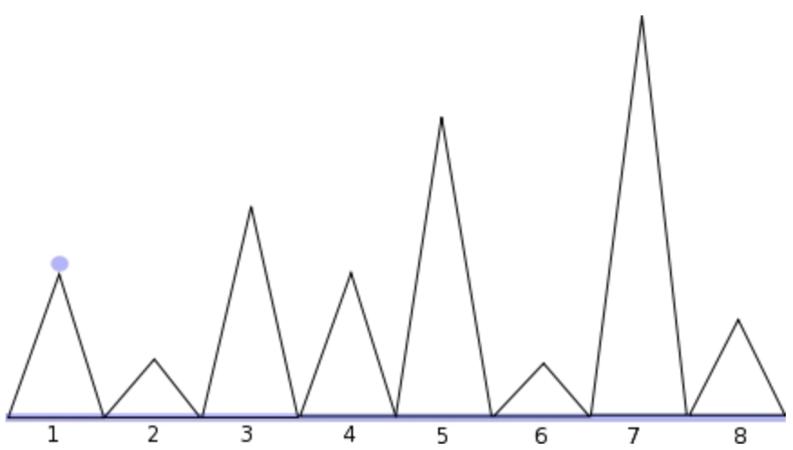

# TP4 (Sections Parallèles et Mini-Projet)

## Sections parallèles
Dans ce exercice nous allons étudier l'utilisation des sections parallèles d'openMP en nous basant sur l'implémentation d'un QuickSort. Ces sections sont activées par la combinaison de deux pragma (`omp parallel sections` et `omp parallel section`)

1. Téléchargez le squelette de quicksort et vérifiez qu'il compile/fonctionne
    1. Exécutez le pour des tailles croissantes de tableau, que constatez vous ?
    2. Expliquez ce comportement
    3. En déduire qu'il faut se méfier du code qu'on vous donne
2. Modifiez la méthode quicksort pour que les appels récursifs soient effectués dans deux sections parallèles d'openMP. Combien de threads sont créées lors du tri d'un tableau ? (utilisez l'option -L de ps sous Linux, -M sous BSD)
3. OpenMP supporte la notion de parallélisme imbriqué mais elle n'est pas activée par défaut. Utilisez la méthode omp_set_nested pour l'activer. Combien de threads sont créees lors du tri ? En déduire le principe de fonctionnement du parallélisme imbriqué
4. Que se passe-t-il si vous fixez le nombre de threads à 1 ?
5. Mesurez les performances des versions séquentielles et parallèles en fonction de la taille du tableau. Qu'en concluez vous ?

## Lignes de vue
Un promeneur veut faire une promenade dans une région montagneuse. Pour cela, il se munie d'un relevé topographique de la zone qu'il va visiter. Il s'agit simplement de la hauteur de chacun des sommets qu'il va rencontrer au cours de son parcours. Le promeneur désire savoir quelles montagnes seront visibles au début de son parcours, et pour cela, nous allons écrire un programme ligne-de-vue.c en OpenMP. Pour simplifier le problème, nous allons considérer les hypothèses suivantes:

- La taille du promeneur est négligeable par rapport à celle des montagnes
- L'environnement est discrétisé, le premier sommet se trouve à la position 1, le deuxième à la position 2... et les sommets ont des hauteurs entières.
- Il ne se déplace qu'en ligne droite, sur des sommets désertiques (pas de végétation ni d'obstacles)
- Il regarde depuis le premier sommet de son parcours
- Il ne voit pas le sommet sur lequel il se trouve
- Il n'y a PAS toujours 2^m sommets

1. Quels sont les sommets visibles par l'observateur placé sur le sommet 1 dans la figure ci-dessous ?

2. En déduire la condition permettant de décider si un sommet n est visible (indication: cette condition utilise les n-1 sommets précédents)
3. L'algorithme prefix vu en cours permet d'appliquer une opération OP sur un ensemble d'éléments tel que yk=x1 OP x2 OP ... OP X(k-1). Quelle propriété doit avoir OP ?
4. Implémentez une méthode max-prefix qui applique l'opération max(x,y) sur un tableau passé en paramètre (indication: vous avez implémenté sum-prefix la semaine dernière en utilisant des tableaux remplis partiellement de 0, qui est l'élément neutre pour l'addition. Quel est l'élément neutre pour max? ). **Pensez à tester cette méthode, c'est la clef du problème**
5. Complétez votre programme pour calculer les sommets visibles. La hauteur des sommets sera stockée dans un fichier qui sera passé en paramètre du programme. Le programme devra afficher 0 si un sommet n'est pas visible, et 1 si il est. Votre application doit avoir exactement la même sortie que celle donnée dans l'exemple ci-dessous (rien de plus, rien de moins):

```
fhuet$ ./ligne-de-vue data1
0 1 1 0 0 0 0 1
fhuet$ ./ligne-de-vue data2
0 1 0 0 0 0 0 0
```

## Rendu
Le projet sera à rendre sur [Jalon](http://jalon.unice.fr) au plus tard le jeudi 13 avril 23.00, sous forme d'un fichier zip contenant
- Un fichier projet.c compilable unique avec `gcc -o projet -Wall -std=c99 projet.c -lm -fopenmp`
- Un fichier pdf  (3 pages max) contenant des courbes expérimentales et leur analyse. Il faudra au moins mesurer le temps d'exécution en fonction du nombre de sommets et du nombre de threads. 

Les critères d'évaluation seront la correction du programme, sa vitesse d'exécution et la qualité du rapport. La similarité des fichiers sera testée pour détecter les copies/emprunts. Tout abus sera sanctionné. Tout retard sera sanctionné.